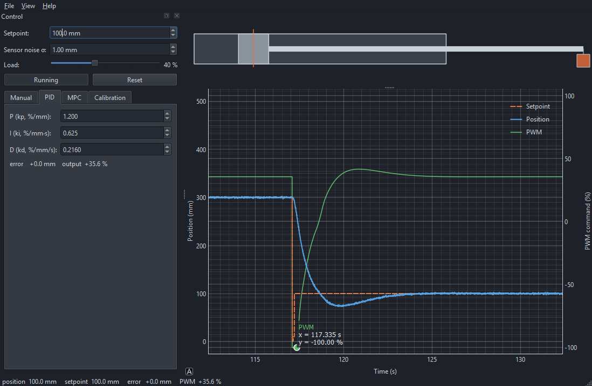

# ControlShowcase



A desktop **control-systems showcase**: a live simulation of automatic **position
control of a bidirectional hydraulic cylinder** driven by a **PWM electronic
proportional valve**. It's built to *see and feel* how different controllers behave
on the same plant — drive the valve by hand, then watch a PID, then a
model-predictive controller chase the same setpoint.

Built with **Python + Qt Widgets (PySide6)** and **pyqtgraph** — the same stack and
visual style as the sibling **CsvPlotter** project.

> **Status: Phase 5 — auto-calibration.** All four modes are live: Manual, PID, MPC,
> and a **safe model-based auto-calibration** that finds the valve deadband and tunes
> PID gains with gentle bounded moves (no instability or sustained oscillation), then
> applies them with one click. Phase 6 (polish: run overlays, CSV export, presets)
> remains. See [`docs/index.html`](docs/index.html) for the architecture and roadmap.

---

## What it will do

- **Manual mode** — drive the valve PWM with a slider to learn the open-loop plant.
- **PID mode** — live **P / I / D** sliders so each term's effect is visible in real time.
- **MPC mode** — a hand-rolled, readable model-predictive controller to compare with PID.
- **Auto-calibration** — find the valve **deadband** and a sane PID tuning automatically.

The UI shows a **control tab** (mode + parameters), an **animated cylinder**, and a
**plot of setpoint vs. actual position**.

---

## Tech stack

| Area | Choice |
|---|---|
| Language | Python 3.10+ |
| GUI | Qt 6 Widgets via **PySide6** (hand-coded, no `.ui` files) |
| Plotting | **pyqtgraph** — Qt-native interactive plotting |
| Maths | **numpy** — plant integration and the MPC optimisation |
| Animation | a custom-painted `QWidget` for the cylinder |
| Platform | Windows first; pure-Python, so Linux/macOS follow |

`requirements.txt`: `PySide6`, `pyqtgraph`, `numpy`.

---

## Getting started

```powershell
# 1. Virtual environment (Windows PowerShell)
python -m venv .venv
.\.venv\Scripts\Activate.ps1

# 2. Dependencies
pip install -r requirements.txt

# 3. Run
python main.py
```

---

## Project structure

```
ControlShowcase/
├── main.py                       # entry point: QApplication + dark theme + MainWindow
├── requirements.txt
├── controlshowcase/
│   ├── main_window.py            # layout + wiring + (later) the simulation loop
│   ├── sim/                      # the plant — valve, cylinder, integrator (no Qt)
│   │   ├── valve.py              # PWM valve: deadband, saturation, first-order lag
│   │   ├── plant.py              # cylinder: 2nd-order dynamics + nonlinearities
│   │   └── simulator.py          # fixed-step integrator, state + rolling history
│   ├── control/                  # controllers (no Qt)
│   │   ├── base.py               # Controller ABC: reset / compute(setpoint, meas, dt)
│   │   ├── manual.py             # passthrough PWM
│   │   ├── pid.py                # PID with anti-windup
│   │   ├── mpc.py                # receding-horizon MPC (numpy)
│   │   └── calibration.py        # deadband finder + PID auto-tune
│   └── ui/
│       ├── theme.py              # shared colour palette
│       ├── control_panel.py      # tabbed Manual / PID / MPC / Calibration controls
│       ├── cylinder_view.py      # the animated cylinder (QPainter)
│       └── plot_view.py          # pyqtgraph: setpoint + position over time
└── docs/                         # index.html + style.css (shared with CsvPlotter)
```

---

## Documentation

[`docs/index.html`](docs/index.html) is the living project document: overview, tech
stack, architecture, feature design, build instructions, and the phased roadmap with
a changelog. It grows at the end of each phase, so the structure is explained as it
is built.
